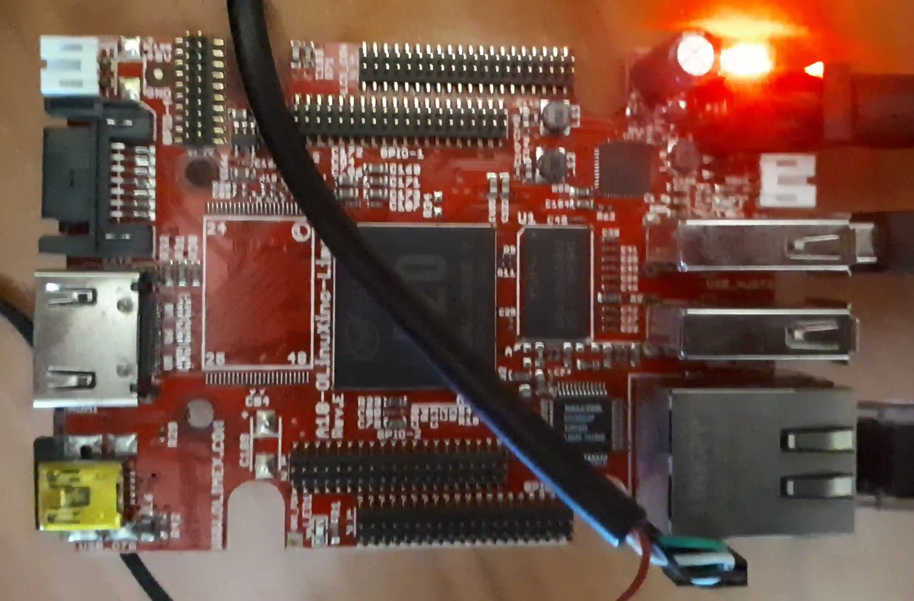
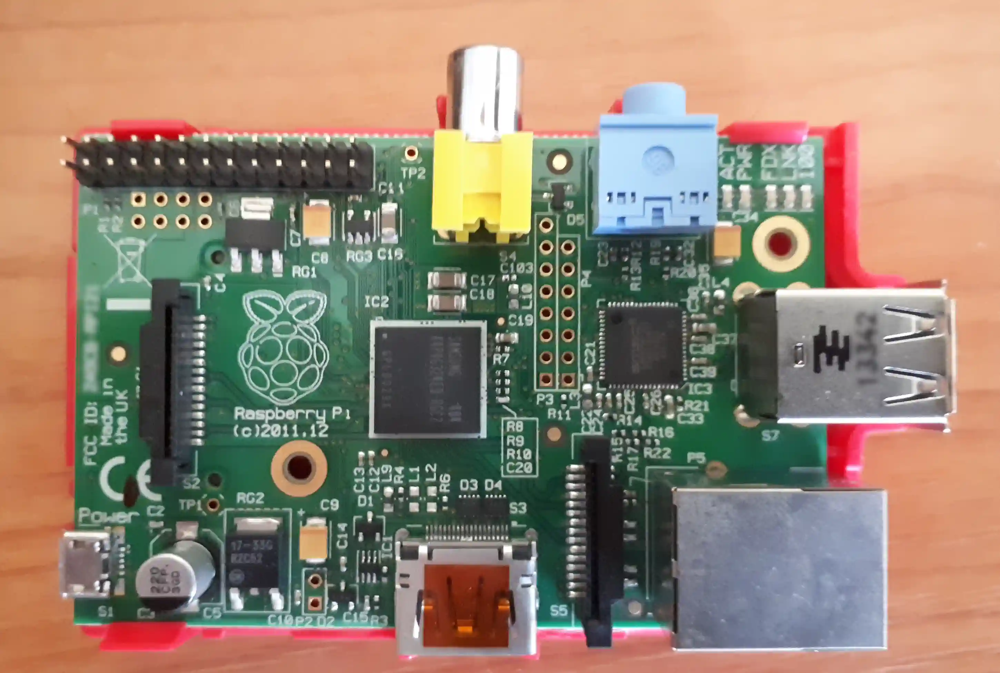
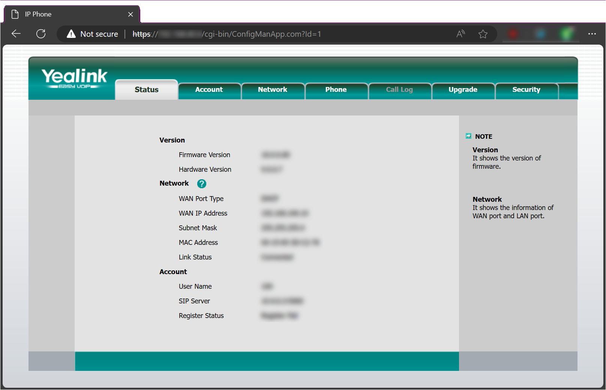

# VPNBridge on OpenWRT

Using *Raspberry Pi* as router with VPN which can be used to connect old tech SIP phones to modern VPN network.
This solution is based on instructions described [here](english.md#connecting-voip-phone-to-the-vpn) but *OpenWRT* will be used instead of *Rasspberry Pi OS*.

## Why *OpenWRT*?

### Pros

- *OpenWRT* is a router-oriented Linux distribution.
- *OpenWRT* is small - image size is smaller than 200MB so even old 1GB microSD card can be used.
- *OpenWRT* is light - low memory and CPU usage.
- *OpenWRT* is fast - even old 1-st gen. *Rasberry Pi* may be used for this purpose.
- *OpenWRT* minimizes write operations to microSD card.
- You're not limited to *Raspberry Pi*.

  There are more SBCs supported by *OpenWRT*. This solution was also tested on:

  - [NanoPi R1S](https://www.friendlyelec.com/index.php?route=product/product&path=69&product_id=274) (H5) from *OpenElec*:

    Small computer with **two** Ethernet interfaces. There are more SBCs with two Ethernet interfaces from this manufacturer.

  - [OLinuXino Lime A20](https://www.olimex.com/Products/OLinuXino/A20/A20-OLinuXino-LIME/) from *Olimex*.

    

### Cons

- *OpenWRT* isn't debian-like distribution.
- *OpenWRT* is poorly documented.

## *OpenWRT* basics

### Configuration files

Main configuration files of *OpenWRT* are located at `/etc/config` directory.
You may use any text editor to modify them but a better approach (used here) is to use [`uci`](https://openwrt.org/docs/guide-user/base-system/uci) command line tool:

```sh
uci set network.lan.ipv6=0
uci add_list network.wan.proto=dhcp
uci set firewall.@rule[-1].name='Rule name'
# more uci set/add commands here ...
uci commit
```

Every `uci set/add/add_list` sequence **must** be commited by `uci commit` command.

### Package manager

[`opkg`](https://openwrt.org/docs/guide-user/additional-software/opkg) is a package manager in *OpenWRT*.
You can easly install, remove or show installed packages with this tool.

Before installing any package a package database must be updated:

```sh
opkg update
```

> [!NOTE]
> Package database is volatile and will be lost on system reboot/shutdown.

Packages prefixed with `kmod-` contains kernel modules. E.g. `kmod-wireguard` package contains kernel modules required to handle *WireGuard* protocol.

### System log

Use [`logread`](https://openwrt.org/docs/guide-user/base-system/log.essentials) command to read system log:

```sh
logread
```

> [!NOTE]
> By default system logs are stored in-memory only and also will be lost on system reboot/shutdown.

## Requirements

- *Rasberry Pi* board.

  Here *Raspberry PI B* will be used :smile:.

  

  But remember. There are more SBCs you can try.

- Power supply.
- USB Ethernet adapter.

  Secondary Ethernet port.
  Prefer adapters for which the chip used is known.
  This helps you to choose proper driver (see below).

  

- SIP Phone.

  Here old [Yealink SIP-T18](http://www.yealink.es/producto/sip-t18p) will be used.

- *microSD* card.

  You may use even 1GB old microSD card. For my board microSD to SD card adapter is required.

- Ethernet cable connected to your router.

  In this solution Ethernet connection is used.
  Wireless connection is possible but in this document we're focused on a more realiable one.

During installation you also should have:

- USB SD card reader.
- [USB to TTL serial cable/adapter](http://elinux.org/RPi_Serial_Connection).

  It **really** helps during network configuration.

## Installation

### Preparing *microSD* card

Just download **proper** image from [OpenWRT site](https://openwrt.org/toh/raspberry_pi_foundation/raspberry_pi) (choose *factory* version), unpack and write it to *microSD* card using your favorite tool. It may be [Raspberry Pi Imager](http://www.raspberrypi.com/software) or even simple `dd` command line utility.

> [!IMPORTANT]
> Please select **proper** image suitable to your *Raspberry Pi* model!

```
# Downloading image for Raspberry PI model B
wget https://downloads.openwrt.org/releases/22.03.5/targets/bcm27xx/bcm2708/openwrt-22.03.5-bcm27xx-bcm2708-rpi-ext4-factory.img.gz
```

### First boot

- Connect setial cable/adapter via GPIO to Raspberry Pi.

  Connect cable/adapter to another computer via USB and run serial terminal emulator on it.
  On Linux you may use `picocom`. On Windows choose *PuTTY*.

  ```sh
  picocom -b 115200 /dev/ttyUSB0
  ```

  See also: [*OpenWRT* - Serial console](https://openwrt.org/docs/techref/hardware/port.serial).

- Insert (micro)SD card into your *Raspberry Pi*.
- Connect your board to your router via Ethernet cable.
- Connect secondary Ethernet adapter.
- Attach power supply.

On serial terminal boot messages should appear:

```
[    0.000000] Booting Linux on physical CPU 0x0
[    0.000000] Linux version 5.15.132 (builder@buildhost) (arm-openwrt-linux-muslgnueabi-gcc (OpenWrt GCC 12.3.0 r23482-7fe85ce1f2) 12.3.0, GNU ld (GNU Binutils) 2.40.0) #0 Fri Sep 29 09:29:36 2023
[    0.000000] CPU: ARMv6-compatible processor [410fb767] revision 7 (ARMv7), cr=00c5387d
[    0.000000] CPU: PIPT / VIPT nonaliasing data cache, VIPT nonaliasing instruction cache
[    0.000000] OF: fdt: Machine model: Raspberry Pi Model B Rev 2
[    0.000000] random: crng init done
[    0.000000] Memory policy: Data cache writeback
[    0.000000] Reserved memory: created CMA memory pool at 0x17c00000, size 64 MiB
[    0.000000] OF: reserved mem: initialized node linux,cma, compatible id shared-dma-pool
[    0.000000] Zone ranges:
[    0.000000]   Normal   [mem 0x0000000000000000-0x000000001bffffff]
[    0.000000] Movable zone start for each node
[    0.000000] Early memory node ranges
[    0.000000]   node   0: [mem 0x0000000000000000-0x000000001bffffff]
[    0.000000] Initmem setup node 0 [mem 0x0000000000000000-0x000000001bffffff]
[    0.000000] Built 1 zonelists, mobility grouping on.  Total pages: 113680
[    0.000000] Kernel command line: coherent_pool=1M snd_bcm2835.enable_compat_alsa=0 snd_bcm2835.enable_hdmi=1 bcm2708_fb.fbwidth=656 bcm2708_fb.fbheight=416 bcm2708_fb.fbswap=1 vc_mem.mem_base=0x1ec00000 vc_mem.mem_size=0x20000000  console=ttyAMA0,115200 console=tty1 root=/dev/mmcblk0p2 rootfstype=squashfs,ext4 rootwait
[    0.000000] Dentry cache hash table entries: 65536 (order: 6, 262144 bytes, linear)
[    0.000000] Inode-cache hash table entries: 32768 (order: 5, 131072 bytes, linear)
[    0.000000] mem auto-init: stack:off, heap alloc:off, heap free:off
[    0.000000] Memory: 378300K/458752K available (6534K kernel code, 614K rwdata, 932K rodata, 1024K init, 353K bss, 14916K reserved, 65536K cma-reserved)
[    0.000000] SLUB: HWalign=32, Order=0-3, MinObjects=0, CPUs=1, Nodes=1
[    0.000000] NR_IRQS: 16, nr_irqs: 16, preallocated irqs: 16
[    0.000005] sched_clock: 32 bits at 1000kHz, resolution 1000ns, wraps every 2147483647500ns
[    0.000074] clocksource: timer: mask: 0xffffffff max_cycles: 0xffffffff, max_idle_ns: 1911260446275 ns
[    0.000171] bcm2835: system timer (irq = 27)
[    0.000874] Console: colour dummy device 80x30
[    0.001385] printk: console [tty1] enabled
...
```


### First login

After several seconds (after the red LED stops blinking) you should be able to log in to your machine just pressing `ENTER`.

```txt
BusyBox v1.36.1 (2023-09-29 09:29:36 UTC) built-in shell (ash)

  _______                     ________        __
 |       |.-----.-----.-----.|  |  |  |.----.|  |_
 |   -   ||  _  |  -__|     ||  |  |  ||   _||   _|
 |_______||   __|_____|__|__||________||__|  |____|
          |__| W I R E L E S S   F R E E D O M
 -----------------------------------------------------
 OpenWrt 23.05.0-rc4, r23482-7fe85ce1f2
 -----------------------------------------------------
=== WARNING! =====================================
There is no root password defined on this device!
Use the "passwd" command to set up a new password
in order to prevent unauthorized SSH logins.
--------------------------------------------------
root@OpenWrt:/#

```

You are logged as root. As you see there's **no root password**.

**TIP**: Unlike ssh, serial connections do not have a mechanism to transfer something like SIGWINCH when a terminal is resized. On *OpenWRT* 23.05 you can manually invoke `resize` command after you resize the terminal's emulator window.

### Installing secondary Ethernet interface

By default the only network interface - `eth0` - is attached to `br-lan` bridge with static address `192.168.1.1`.
We must change this configuration to obtain address from your router via DHCP:

```sh
uci set network.lan.proto=dhcp
uci commit
service network reload
```

After few seconds you should get access to internet:

```sh
# ip a

1: lo: <LOOPBACK,UP,LOWER_UP> mtu 65536 qdisc noqueue state UNKNOWN qlen 1000
    link/loopback 00:00:00:00:00:00 brd 00:00:00:00:00:00
    inet 127.0.0.1/8 scope host lo
       valid_lft forever preferred_lft forever
    inet6 ::1/128 scope host 
       valid_lft forever preferred_lft forever
2: eth0: <NO-CARRIER,BROADCAST,MULTICAST,UP> mtu 1500 qdisc fq_codel master br-lan state UP qlen 1000
    link/ether bc:de:f0:12:34:56 brd ff:ff:ff:ff:ff:ff
3: br-lan: <BROADCAST,MULTICAST,UP,LOWER_UP> mtu 1500 qdisc noqueue state UP qlen 1000
    link/ether 00:12:34:56:78:9a brd ff:ff:ff:ff:ff:ff
    inet 192.168.40.8/24 brd 192.168.40.255 scope global br-wan
       valid_lft forever preferred_lft forever
    inet6 fe80::213:3bff:fe99:a7a2/64 scope link 
       valid_lft forever preferred_lft forever
```

Now we're able to download and install kernel module for your secondary Ethernet interface.
*OpenWRT* by default comes with a minimal set of kernel modules.
If you want to install additional hardware you must install proper kernel module. But which package should be installed?

There are only few possible options:

- `kmod-usb-net-rtl8152`
- `kmod-usb-net-asix`
- `kmod-usb-net-asix-ax88179`
- `kmod-usb-net-rtl8150`
- `kmod-usb-net-dm9601-ether`

If yor know which chip is used by your Ethernet adapter choosing proper kernel module should be easy. If you don't  check out `dmesg` output:

- *ASIX* chip example:

  ```log
  [    3.016282] usb 1-1.3: New USB device found, idVendor=0b95, idProduct=772b, bcdDevice= 0.01
  [    3.030980] usb 1-1.3: New USB device strings: Mfr=1, Product=2, SerialNumber=3
  [    3.041490] usb 1-1.3: Product: AX88772B
  [    3.048453] usb 1-1.3: Manufacturer: ASIX Elec. Corp.
  [    3.056468] usb 1-1.3: SerialNumber: 000451
  ```

  so `kmod-usb-net-asix` package should be installed:

  ```sh
  opkg update
  opkg install kmod-usb-net-asix
  ```

- *Realtek 8152* chip example:

  ```log
  [    2.754477] usb 1-1.2: New USB device found, idVendor=0bda, idProduct=8152, bcdDevice=20.00
  [    2.762999] usb 1-1.2: New USB device strings: Mfr=1, Product=2, SerialNumber=3
  [    2.770358] usb 1-1.2: Product: USB 10/100 LAN
  [    2.774873] usb 1-1.2: Manufacturer: Realtek
  [    2.779179] usb 1-1.2: SerialNumber: 00E04A364AB0
  ```

  so `kmod-usb-net-rtl8152` package should be installed:

  ```sh
  opkg update
  opkg install kmod-usb-net-rtl8152
  ```

- Davicom DM96xx chip example:

  ```log
  [    2.755156] usb 1-1.3: New USB device found, idVendor=0fe6, idProduct=9700, bcdDevice= 1.01
  [    2.763724] usb 1-1.3: New USB device strings: Mfr=0, Product=2, SerialNumber=0
  [    2.771091] usb 1-1.3: Product: USB 2.0 10/100M Ethernet Adaptor
  ```

  here `kmod-usb-net-dm9601-ether` is required:

  ```sh
  opkg update
  opkg install kmod-usb-net-dm9601-ether
  ```

After package installation new network interface `eth1` should appear immediately:

```sh
# ip a

4: eth1: <BROADCAST,MULTICAST,UP,LOWER_UP> mtu 1500 qdisc fq_codel state DOWN qlen 1000
    link/ether 00:12:34:56:78:9a brd ff:ff:ff:ff:ff:ff
```

### Network configuration

New Ethernet device will be a WAN (connected to your router) and onboard Ethernet will be a LAN with static addres `192.168.100.1` and DHCP server enabled:

```sh
uci add network device
uci set network.@device[-1].name=br-wan
uci set network.@device[-1].type=bridge
uci add_list network.@device[-1].ports=eth1
uci set network.@device[-1].bridge_empty=1
uci set network.@device[-1].stp=1

uci set network.wan=interface
uci set network.wan.device=br-wan
uci set network.wan.proto=dhcp
uci set network.wan.ipv6=0

uci set network.lan.proto=static
uci set network.lan.ipaddr=192.168.100.1

uci commit
```

Detach Ethernet cable from onboard Ethernet socket and attach it to USB Ethernet adapter then reboot your board:

```sh
reboot
```

After reboot *Raspberry Pi* shoud have access to internet via secondary Ethernet interface.

### Configuring static DHCP lease for your SIP phone

- If you know phone's MAC address:

  Configure static lease directly:

  ```sh
  uci add dhcp host
  uci set dhcp.@host[-1].mac=00:23:45:67:89:ab
  uci set dhcp.@host[-1].ip=192.168.100.10
  uci set dhcp.lan.dynamicdhcp=0
  uci commit

  service dnsmasq reload
  ```

  where `00:23:45:67:89:ab` is a MAC address of your phone.
  Now you may connect your phone to your board via Ethernet cable.
  It should obtain `192.168.100.10` IP address.

- If you don't know phone's MAC address:

  Just connect your phone via Ethernet cable to your board and check system log:

  ```sh
  dnsmasq-dhcp[1]: DHCPDISCOVER(br-lan) 00:34:56:78:9a:bc
  dnsmasq-dhcp[1]: DHCPOFFER(br-lan) 192.168.100.141 00:34:56:78:9a:bc
  dnsmasq-dhcp[1]: DHCPREQUEST(br-lan) 192.168.100.141 00:34:56:78:9a:bc
  dnsmasq-dhcp[1]: DHCPACK(br-lan) 192.168.100.141 00:34:56:78:9a:bc
  ```

  Having MAC (`00:34:56:78:9a:bc`) address configure static lease as described above and reboot.

### *WireGuard* installation and configuration

- Install required packages:
  
  ```sh
  opkg update
  opkg install kmod-wireguard wireguard-tools
  ```

- Generate private and public keys:

  ```sh
  cd ~
  mkdir wg
  cd wg
  wg genkey > client.privkey
  wg pubkey < client.privkey > client.pubkey
  wg genpsk > client.psk
  ```

- Configure `wg0` interface:

  ```sh
  uci set network.wg0=interface
  uci set network.wg0.proto=wireguard
  uci set network.wg0.private_key=$(cat client.privkey)
  uci add_list network.wg0.addresses=<IP address>
  uci set network.wg0.listen_port=<port number>
  uci commit
  ```

- Configure *WireGuard* peer:

  Collect some data from your *WireGuard* "server":

  - public key,
  - edpoint IP address,
  - endpoint listen port,
  - Wireguard network address (e.g. `10.9.0.0/24`).

  Now yo're able to configure a peer:

  ```sh
  uci add network wireguard_wg0
  uci set network.@wireguard_wg0[-1].public_key=<pbulic key of your server>
  uci set network.@wireguard_wg0[-1].route_allowed_ips=1
  uci set network.@wireguard_wg0[-1].endpoint_host=<IP address of your server>
  uci set network.@wireguard_wg0[-1].endpoint_port=<listen port of your server>
  uci set network.@wireguard_wg0[-1].persistent_keepalive=15
  uci add_list network.@wireguard_wg0[-1].allowed_ips=<wg network address>
  uci set network.@wireguard_wg0[-1].preshared_key=$(cat client.psk)
  ```

- Configure peer on "server" side.

  See [here](wireguard.md) for more info.

- Configure firewall:
  - Accept incomming traffic from *WireGuard* "server":

    ```sh
    uci add firewall rule
    uci set firewall.@rule[-1].name='Remote WireGuard'
    uci set firewall.@rule[-1].src=wan
    uci add_list firewall.@rule[-1].dest_port=<wg listen port>
    uci set firewall.@rule[-1].proto=udp
    uci set firewall.@rule[-1].target=ACCEPT
    ```

  - Define `vpn` zone:

    ```sh
    uci add firewall zone
    uci set firewall.@zone[-1].name=vpn
    uci set firewall.@zone[-1].input='REJECT'
    uci set firewall.@zone[-1].forward='REJECT'
    uci set firewall.@zone[-1].output='ACCEPT'
    uci set firewall.@zone[-1].masq=1
    uci add_list firewall.@zone[-1].network=wg0
    ```

  - Allow forwarding between `lan` and `vpn` zones:

    ```sh
    uci add firewall forwarding
    uci set firewall.@forwarding[-1].src=lan
    uci set firewall.@forwarding[-1].dest=vpn

    uci commit
    ```

  - Configure DHCP server

    Do not listen DHCP requests on `wg0` interface at all:

    ```sh
    uci add_list dhcp.@dnsmasq[0].notinterface=wg0
    uci commit

    service dnsmasq reload
    ```

  - Reboot:

    ```sh
    reboot
    ```

- After reboot check *WireGuard* connection status via `wg` command:

  ```sh
  root@OpenWrt:/# wg

  interface: wg0
    public key: <public key here>
    private key: (hidden)
    listening port: 13231

  peer: <public key here>
    preshared key: (hidden)
    endpoint: XXX.XXX.XXX.XXX:13231
    allowed ips: 10.9.0.0/24
    latest handshake: 2 minutes, 20 seconds ago
    transfer: 32.12 KiB received, 21.66 KiB sent
    persistent keepalive: every 15 seconds

  ```

### Install `nano` text editor (optional)

By default *OpenWRT* comes with *famous* `vi` text editor only :no_mouth:.
You may install more user friendly `nano` editor:

```sh
opkg update
opkg install nano
```

### NGiNX installation and configuration

- Install NGiNX:

  ```sh
  service uhttpd disable
  service uhttpd stop
  opkg update
  opkg install nginx-ssl
  uci set nginx.global.uci_enable=0
  uci commit
  ```

- Create `/etc/nginx/nginx.conf` configuration file with the following content:

  ```nginx
  worker_processes auto;

  user root;

  include module.d/*.module;

  events {}

  http {
    error_log syslog:server=unix:/dev/log,tag=nginx warn;

    log_format openwrt
      '$request_method $scheme://$host$request_uri => $status'
      ' (${body_bytes_sent}B in ${request_time}s, ratio $gzip_ratio) <- $http_referer'
      ' -> $proxy_add_x_forwarded_for';
    access_log syslog:server=unix:/dev/log,tag=nginx,severity=info openwrt;

    include mime.types;
    default_type application/octet-stream;
    sendfile on;

    client_max_body_size 128M;
    large_client_header_buffers 2 1k;

    gzip on;
    gzip_disable "msie6";
    gzip_vary on;
    gzip_proxied any;
    gzip_min_length 2048;
    gzip_types
      application/atom+xml
      application/geo+json
      application/javascript
      application/x-javascript
      application/json
      application/ld+json
      application/manifest+json
      application/rdf+xml
      application/rss+xml
      application/xhtml+xml
      application/xml
      font/eot
      font/otf
      font/ttf
      image/svg+xml
      text/css
      text/javascript
      text/plain
      text/xml;

    root /www;
    include conf.d/*.conf;
  }
  ```

- Create `/etc/nginx/conf.d/sip-phone.conf` configuration file with the following content:

  ```nginx
  server {
      listen 443 ssl http2 default_server;
      server_name _;

      ssl_protocols TLSv1.2 TLSv1.3;
      ssl_prefer_server_ciphers on;
      ssl_session_tickets off;
      ssl_ciphers 'TLS13-CHACHA20-POLY1305-SHA256:TLS13-AES-256-GCM-SHA384:TLS13-AES-128-GCM-SHA256:ECDHE-ECDSA-AES256-GCM-SHA384:ECDHE-RSA-AES256-GCM-SHA384:ECDHE-ECDSA-CHACHA20-POLY1305:ECDHE-RSA-CHACHA20-POLY1305:ECDHE-ECDSA-AES128-GCM-SHA256:ECDHE-RSA-AES128-GCM-SHA256:ECDHE-ECDSA-AES256-SHA384:ECDHE-RSA-AES256-SHA384:ECDHE-ECDSA-AES128-SHA256:ECDHE-RSA-AES128-SHA256';

      ssl_certificate /etc/nginx/conf.d/_lan.crt;
      ssl_certificate_key /etc/nginx/conf.d/_lan.key;

      location / {
        proxy_connect_timeout 15s;
        proxy_read_timeout 15s;
        proxy_send_timeout 15s;
        proxy_cache_valid 5m;
        proxy_set_header X-Forwarded-For $proxy_add_x_forwarded_for;
        proxy_set_header X-Forwarded-Proto $scheme;
        proxy_set_header X-Real-IP $remote_addr;
        proxy_redirect off;
        proxy_pass http://192.168.100.10;
        proxy_http_version 1.1;
        add_header X-Frame-Options DENY;
        add_header X-Content-Type-Options nosniff;
      }
  }

  server {
      listen 80 default_server;
      server_name _;
      return 301 https://$host$request_uri;
  }
  ```

- Configure firewall:

  Allow HTTP(S) requests from WAN side:

  ```sh
  uci add firewall rule
  uci set firewall.@rule[-1].name='Remote HTTP(S)'
  uci set firewall.@rule[-1].src=wan
  uci add_list firewall.@rule[-1].dest_port=80
  uci add_list firewall.@rule[-1].dest_port=443
  uci set firewall.@rule[-1].proto=tcp
  uci set firewall.@rule[-1].target=ACCEPT
  uci commit
  
  service firewall reload
  ```

- Restart nginx service:

  ```sh
  service nginx restart
  ```

- Try to access your SIP phone's web interface from your network:

  

## Hardening your bridge

At this point your *Raspberry Pi* should be fully configured but there are some optional configuration tasks you can perform.

### Change hostname

```sh
uci set system.@system[0].hostname='VPNBridge'
uci commit
reboot
```

### Change timezone

You must find *POSIX timezone string* for your timezone. Check [timezone database](https://github.com/openwrt/luci/blob/master/modules/luci-lua-runtime/luasrc/sys/zoneinfo/tzdata.lua).

```sh
# Europe/Warsaw timezone
uci set system.@system[0].timezone='CET-1CEST,M3.5.0,M10.5.0/3'
uci commit

service sysntpd reload
```

You may also configure DHCP to serve timezone:

```sh
uci add_list dhcp.lan.dhcp_option=option:posix-timezone,CET-1CEST,M3.5.0,M10.5.0/3
uci add_list dhcp.lan.dhcp_option=option:tzdb-timezone,Europe/Warsaw
uci commit

service dnsmasq reload
```

### Accept SSH connections from WAN side

This is WAN from *Raspberry Pi* perspective.
But it's LAN from your router perspective.

```sh
uci add firewall rule
uci set firewall.@rule[-1].name='Remote SSH'
uci set firewall.@rule[-1].src=wan
uci add_list firewall.@rule[-1].dest_port=22
uci set firewall.@rule[-1].proto=tcp
uci set firewall.@rule[-1].target=ACCEPT

uci commit
service firewall reload
```

### Install and configure `sudo`

- Install `sudo`:

  ```sh
  opkg update
  opkg install sudo shadow-useradd shadow-usermod shadow-chpasswd shadow-groupadd shadow-groupmod
  ```

- Configure `sudo`:

  Create `/etc/sudoers.d/sudo` file with the following content:

  ```txt
  %sudo ALL=(ALL) ALL
  Defaults:%sudo !authenticate
  ```

- Create `sudo` group:

  ```sh
  groupadd -r sudo
  ```

- Create `admin` user:

  Setting `admin`'s password to `admin`.
  **Please change it!**

  ```sh
  useradd -G sudo -s /bin/ash admin
  echo 'admin:admin' | chpasswd
  mkdir -p /home/admin
  chown -R admin:admin /home/admin
  chmod 750 /home/admin
  ```

- Disable remote root login:

  ```sh
  uci set dropbear.@dropbear[0].RootPasswordAuth=off
  uci commit
  reboot
  ```

  See also [*OpenWRT* - Dropbear key-based authentication](https://openwrt.org/docs/guide-user/security/dropbear.public-key.auth).

- Create `root`'s password:

  ```sh
  passwd
  ```

- Try to log in to *Raspberry Pi* via SSH as `admin`:

  ```sh
  ssh admin@<your raspberry pi addres>
  ```

  After login try `sudo` command:

  ```sh
  sudo logread
  ```
  
### Remove unused packages

There are many packages to remove.

```sh
opkg remove iw iwinfo kmod-sound-core luci-base luci-app-firewall luci-app-opkg luci-proto-ipv6 luci-proto-ppp luci-theme-bootstrap uhttpd wireless-regdb wpad-basic-mbedtls kmod-ppp rpcd-mod-luci liblucihttp0 --force-removal-of-dependent-packages

rm /etc/config/luci
rm /etc/config/uhttpd
```

### Enable NTP server

- Enable NTP server

  Enable local NTP (time) server:

  ```sh
  uci set system.ntp.enable_server=1
  uci commit
  ```

- Configure DHCP

  Serve local NTP server via DHCP:

  ```sh
  uci add_list dhcp.lan.dhcp_option='option:ntp-server,192.168.100.1'
  uci commit
  ```

- Configure firewall

  Redirect all outgoing NTP requests to local NTP server:

  ```sh
  uci add firewall redirect
  firewall.@redirect[-1].name='Redirect NTP requiests to local server'
  firewall.@redirect[-1].src=lan
  firewall.@redirect[-1].src_dport=123
  firewall.@redirect[-1].dest=wan
  firewall.@redirect[-1].target=DNAT
  firewall.@redirect[-1].dest_ip=192.168.100.1
  uci commit

  reboot
  ```

### Install `rng-tools`

```sh
opkg update
opkg install rng-tools

uci set system.@rngd[0].enabled=1
uci delete system.@rngd[0].device
uci commit

reboot
```

### Make your *Raspberry Pi* headless

Turn off video output at all. Also disable Bluetooth an WiFi (if unused).

Append following lines to `/boot/config.txt` file:

```txt
gpu_mem=16
max_framebuffers=0
hdmi_ignore_hotplug=1
enable_tvout=0
dtoverlay=disable-bt
dtoverlay=disable-wifi
dtoverlay=cma,cma-size=8388608
```

Then reboot.

> [!NOTE]
> This operation should increase available RAM memory.
> On my board this is noticeable change from `444860K` to `493696K`.

### Configure LED trigger :wink:

The `activity` LED trigger is similar to well known `heartbeat` one but provides instant indication of the immediate CPU usage.

```sh
opkg update
opkg install kmod-ledtrig-activity

uci set system.led0=led
uci set system.led0.sysfs=led0
uci set system.led0.trigger=activity
uci commit

reboot
```

## Links

- [*OpenWRT* - Raspberry PI](https://openwrt.org/toh/raspberry_pi_foundation/raspberry_pi)
- [*OpenWRT* - Serial console](https://openwrt.org/docs/techref/hardware/port.serial)
- [RPi Serial Connection](https://elinux.org/RPi_Serial_Connection)
- [*OpenWRT* - Dropbear key-based authentication](https://openwrt.org/docs/guide-user/security/dropbear.public-key.auth).
- [*OpenWRT* - The UCI system](https://openwrt.org/docs/guide-user/base-system/uci)
- [*OpenWRT* - Opkg package manager](https://openwrt.org/docs/guide-user/additional-software/opkg)
- [*OpenWRT* - Logging messages](https://openwrt.org/docs/guide-user/base-system/log.essentials)
- [*OpenWRT* - DHCP and DNS configuration](https://openwrt.org/docs/guide-user/dhcp/dhcp_configuration)
- [*OpenWRT* - Firewall configuration](https://openwrt.org/docs/guide-user/firewall/firewall_configuration)
- [*OpenWRT* - NTP](https://openwrt.org/docs/guide-user/advanced/ntp_configuration)
- [*OpenWRT* - WireGuard client](https://openwrt.org/docs/guide-user/services/vpn/wireguard/client)
- [*EKO ONE* - WireGuard](https://eko.one.pl/?p=openwrt-wireguard) (polish)
- [*OpenWRT* - LED Configuration](https://openwrt.org/docs/guide-user/base-system/led_configuration)
- [*OpenWRT* - System configuration](https://openwrt.org/docs/guide-user/base-system/system_configuration)
- [Run OpenWrt + Nginx + PHP7 + SQLite + Wordpress in Raspberry Pi4](https://gist.github.com/monnoval/6894336484613b02fafc9c75bc18656b)
